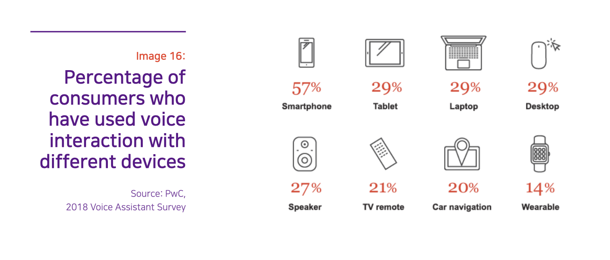

### **Ficha Técnica**

- Duração: 34m 17s
- Entrevistados nesta edição: 
    - [Mariana Valente](https://twitter.com/mrnvlnt), advogada, diretora do InternetLab, PhD pela USP e pesquisadora do Cebrap

### DADOS

Os gráficos abaixo foram retirados diretamente do relatório *The Rise of Gendered AI and its Troubling Repercussions*, da Unesco (*link as referências*).

                        |

### LINKS

- **Vídeo**: Voz sem gênero ([ThirtySoundsGood](http://www.thirtysoundsgood.dk/?flv_portfolio=q-the-worlds-first-genderless-voice))
- **Estudo**: The Rise of Gendered AI and its Troubling Repercussions
 (Página 85, [Unesco](https://unesdoc.unesco.org/in/documentViewer.xhtml?v=2.1.196&id=p::usmarcdef_0000367416&file=/in/rest/annotationSVC/DownloadWatermarkedAttachment/attach_import_77988d38-b8bd-4cc1-b9b4-3cc16d631bf9%3F_%3D367416eng.pdf&locale=en&multi=true&ark=/ark:/48223/pf0000367416/PDF/367416eng.pdf#%5B%7B%22num%22%3A384%2C%22gen%22%3A0%7D%2C%7B%22name%22%3A%22XYZ%22%7D%2C0%2C842%2Cnull%5D))

### CRÉDITOS

- **Apresentação, roteiro, pesquisa e produção**: Sérgio Spagnuolo
- **Produção executiva**: Francisco Brito Cruz
- **Edição**: Murilo Roncolato
- **Música de abertura**: [_Alteração (ÉA!)_](https://www.youtube.com/watch?v=EmCgOADirkg) por BNegão e os Seletores de Frequência (com permissão do artista)  
- **Trilhas**: Maribou State - 'Natural Fools' ([YouTube](https://www.youtube.com/watch?v=6YWeZNH4adM))

---

## Transcrição do episódio #7

*Em breve*

**Introdução**

**Sérgio Spagnuolo**: Estamos agora em um momento de transição entre tecnologias já existentes e a quase total automação de nossas vidas. Perto de um futuro no qual vamos ser transportados por carros autômatos, no qual teremos nossas encomendas entregues por drones na porta de casa, no qual as nossas geladeiras farão suas próprias compras, a televisão selecionará nosso conteúdo inteiramente por comando de voz e as portas, luzes e quase todos os aspectos de nossas casas serão controlados pela Internet.

Não há uma data exata para tudo isso estar totalmente integrado em nossas vidas, mas conseguimos especular que nos próximos cincos anos a adoção de muitas das tecnologias de automação de nossas vidas será cada vez mais rápida e decisiva.

E nenhuma tecnologia é tão crucial para esse futuro quanto as, ou os, assistentes virtuais. Esse recurso é que provavelmente interligará todos os aspectos de nossas vidas em uma única central de comandos.

Assistentes virtuais nada mais são do que algoritmos pessoais, que aprenderão com seus comandos, rotinas e dúvidas a melhor lhe ajudar no dia a dia, a compor sua agenda, a saber o trânsito, a ouvir as notícias e a organizar sua casa.

Os benefícios são muito claros e tangíveis. Os problemas, nem tanto, diluídos em meio à benesse.

Em primeiro lugar, temos sempre a grande questão acerca de tudo na Internet: pra onde vão nossos dados e o que é feito com eles. Mas há também outras questões importantes em jogo, como o excesso de dependência em nossos equipamentos eletrônicos e a exclusão digital.

Mais sutilmente, temos os preconceitos gerados, mantidos e reforçados pelo aprendizado de máquina e por como esses recursos são construídos. Preconceitos que, em algum momento, tocam na questão de gênero e como percebemos o mundo real.

Essa é uma história sobre gênero e inteligência artificial, e o quão pouco pensamos nisso.

Você está ouvindo o Caixa-Preta, um podcast que desvenda o impacto da tecnologia na sociedade, uma parceria entre o Volt Data Lab e o InternetLab. Eu sou Sérgio Spagnuolo.

E começa, agora.

**Sérgio**: Inicialmente, encantado com a minha recém-aquisição de um Google Home, eu queria falar sobre como esses trecos que respondem a seus comandos iriam revolucionar nossas vidas, se tornar uma parte incorporada de nossos cotidianos, desatada das dificuldades e chatices de configurar, atualizar e renovar nossos aplicativos.

Ao conversar com **Mariana Valente**, no entanto, a pauta e até minha percepção sobre esses dispositivos mudou. Ainda acho que eles são interessantes, úteis e importantes para o dia a dia, mas certamente já vejo com outros olhos as implicações que essas novas tecnologias podem ter.

A Mari é diretora do InternetLab e doutora pela USP, e vem acompanhando temas ligados a tecnologia e gênero há anos.

Vamos para a entrevista.
